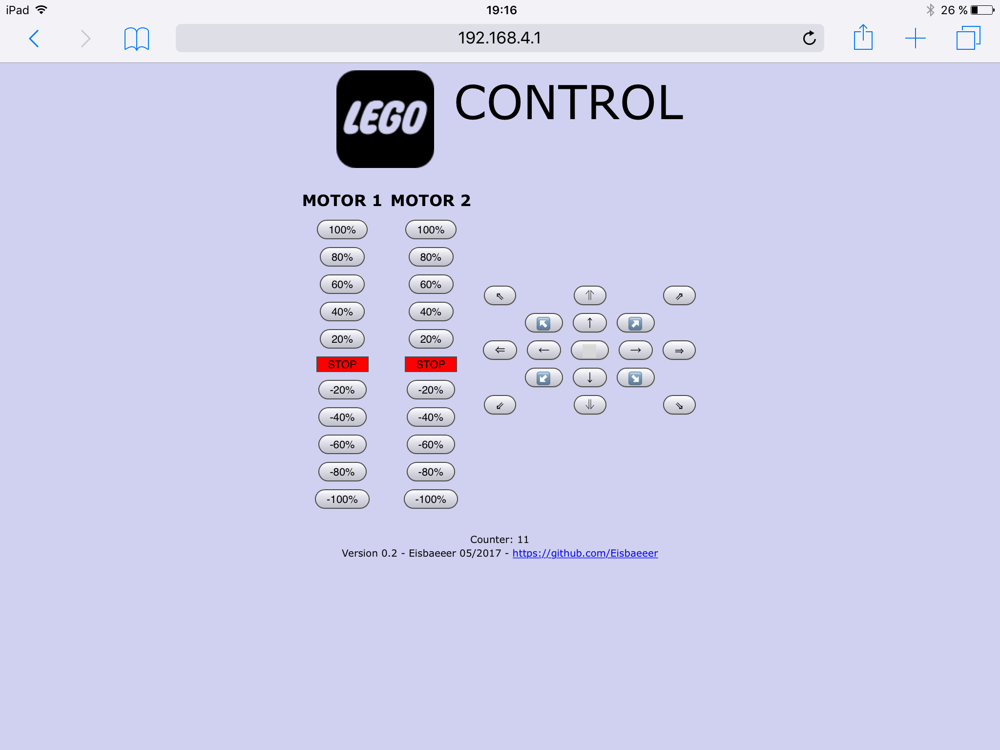

# LEGO Controller

This is a project to control 2 stepper motors 28BYJ with a Nodemcu ESP8266.
The STL files for printing the housing can be found here: https://www.thingiverse.com/make:334521

The project is written in Arduino IDE to flash an ESP8266.

## ChangeLog

### 0.0.20
* (Eisbaeeer) adding control pad

### 0.0.10
* (Eisbaeeer) initial version

